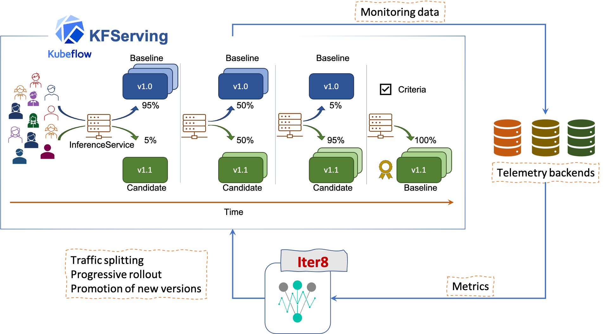

# Iter8-kfserving
> [KFServing](https://github.com/kubeflow/kfserving) enables serverless inferencing on [Kubernetes](https://kubernetes.io) and [OpenShift](https://www.openshift.com). [Iter8](https://iter8.tools) enables metrics-driven live experiments, release engineering and rollout optimization for Kubernetes and OpenShift applications. The iter8-kfserving package brings the two projects together.

The picture below illustrates an automated canary rollout orchestrated by iter8-kfserving.



## Table of Contents
- [Quick start on Minikube](#Quick-start-on-Minikube)
- Installation
- Experimentation strategies
  * Automated canary rollouts
- Metrics and experiment criteria
- Concurrent experiments
- [Under the hood](./docs/underthehood.md)
- Reference
  * Experiment CRD
  * Metrics CRD
  * [Out-of-the-box iter8-kfserving metrics](./docs/metrics_ootb.md)
  * [Adding a custom metric](./docs/metrics_custom.md)
- [Roadmap](./docs/roadmap.md)
- [Contributing](./docs/roadmap.md#Contributing)

## Quick start on Minikube
Steps 1 through 10 below enable you to perform automated canary rollout of a KFServing model using latency and error-rate metrics collected in a Prometheus backend. Metrics definition and collection is enabled by the KNative monitoring and iter8-kfserving components installed in Step 3 below.

**Step 1:** Start Minikube with sufficient resources.
```
minikube start --cpus 4 --memory 8192 --kubernetes-version=v1.17.11 --driver=docker
```

**Step 2:** Git clone iter8-kfserving.
```
git clone https://github.com/iter8-tools/iter8-kfserving.git
```

**Step 3:** Install KFServing, KNative monitoring, and iter8-kfserving. This step takes a couple of minutes.
```
cd iter8-kfserving
export ITER8_KFSERVING_ROOT=$PWD
./quickstart/install-everything.sh
```

**Step 4:** Verify that pods are running.
```
kubectl wait --for condition=ready --timeout=180s pods --all -n kfserving-system
kubectl wait --for condition=ready --timeout=180s pods --all -n knative-monitoring
kubectl wait --for condition=ready --timeout=180s pods --all -n iter8-system
```

**Step 5:** *In a separate terminal,*, setup Minikube tunnel.
```
minikube tunnel --cleanup
```
Enter password if prompted in the above step.

**Step 6:** Create InferenceService in the `kfserving-test` namespace.
```
kubectl create ns kfserving-test
kubectl apply -f samples/common/sklearn-iris.yaml -n kfserving-test
```
This creates the `default` and `canary` versions of sklearn-iris model (`flowers` and `flowers-2` respectively).

**Step 7:** Verify that the InferenceService is ready. This step takes a couple of minutes.
```
kubectl wait --for condition=ready --timeout=180s inferenceservice/sklearn-iris -n kfserving-test
```

**Step 8:** Send prediction requests to model versions. *In a separate terminal,* from your iter8-kfserving folder, export `SERVICE_HOSTNAME`, `INGRESS_HOST` and `INGRESS_PORT` environment variables, and send prediction requests to the inference service as follows.
```
export INGRESS_HOST=$(kubectl -n istio-system get service istio-ingressgateway -o jsonpath='{.status.loadBalancer.ingress[0].ip}')
export INGRESS_PORT=$(kubectl -n istio-system get service istio-ingressgateway -o jsonpath='{.spec.ports[?(@.name=="http2")].port}')
export SERVICE_HOSTNAME=$(kubectl get inferenceservice sklearn-iris -n kfserving-test -o jsonpath='{.status.url}' | cut -d "/" -f 3)
watch -n 1.0 'curl -v -H "Host: ${SERVICE_HOSTNAME}" http://${INGRESS_HOST}:${INGRESS_PORT}/v1/models/sklearn-iris:predict -d @./samples/common/input.json'
```

<!-- ### Observe metrics

9.*In a separate terminal,* port forward Prometheus so that you can observe metrics for default and canary model versions.

```
kubectl port-forward -n knative-monitoring \
$(kubectl get pods -n knative-monitoring \
--selector=app=prometheus --output=jsonpath="{.items[0].metadata.name}") \
9090
```
You can now access the Prometheus UI at `http://localhost:9090`. -->

**Step 9:** Create the canary rollout experiment.
```
kubectl apply -f samples/experiments/example1.yaml -n kfserving-test
```

**Step 10:** Watch as the canary version succeeds and gets promoted as the new default.
```
kubectl get inferenceservice -n kfserving-test --watch
```

You should see output similar to the following.

```
NAME           URL                                              READY   DEFAULT TRAFFIC   CANARY TRAFFIC   AGE
sklearn-iris   http://sklearn-iris.kfserving-test.example.com   True    95                5                112s
sklearn-iris   http://sklearn-iris.kfserving-test.example.com   True    95                5                2m47s
sklearn-iris   http://sklearn-iris.kfserving-test.example.com   True    85                15               2m47s
sklearn-iris   http://sklearn-iris.kfserving-test.example.com   True    85                15               3m10s
sklearn-iris   http://sklearn-iris.kfserving-test.example.com   True    75                25               3m11s
sklearn-iris   http://sklearn-iris.kfserving-test.example.com   True    75                25               3m33s
sklearn-iris   http://sklearn-iris.kfserving-test.example.com   True    65                35               3m33s
sklearn-iris   http://sklearn-iris.kfserving-test.example.com   True    65                35               3m55s
sklearn-iris   http://sklearn-iris.kfserving-test.example.com   True    55                45               3m56s
sklearn-iris   http://sklearn-iris.kfserving-test.example.com   True    55                45               3m59s
sklearn-iris   http://sklearn-iris.kfserving-test.example.com   True    100                                4m
sklearn-iris                                                    False                                      4m
sklearn-iris                                                    False                                      4m
sklearn-iris                                                    False                                      4m34s
sklearn-iris                                                    False                                      4m35s
sklearn-iris                                                    False                                      4m35s
sklearn-iris   http://sklearn-iris.kfserving-test.example.com   True    100                                4m36s
```

If you inspect the InferenceService object (`kubectl get inferenceservice -n kfserving-test -o yaml`), you will notice that `flowers-2` (canary version) has been **promoted** as the new default, all traffic flows to `flowers-2`, and there is no longer a canary version.