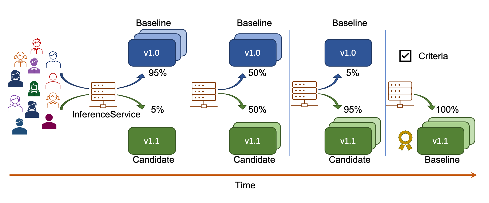
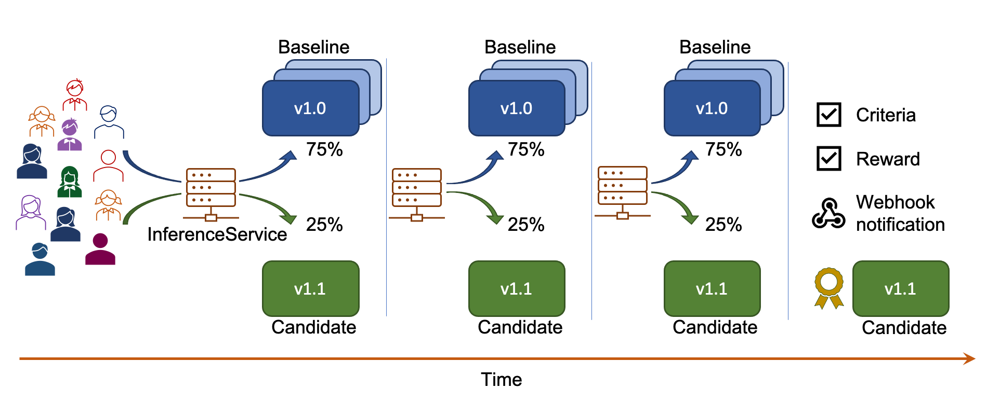
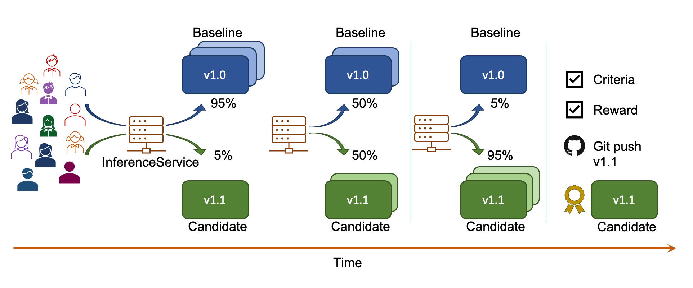
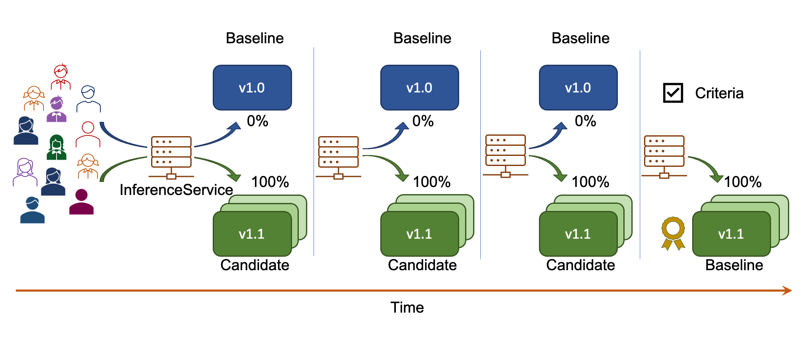
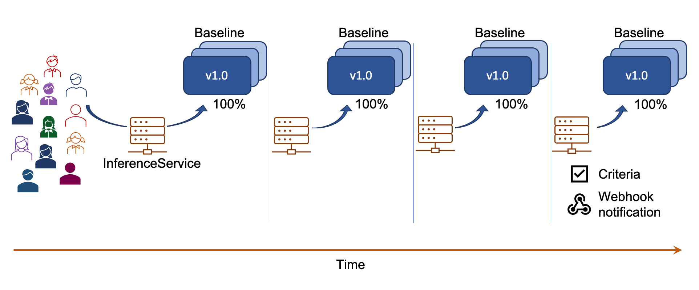

# Iter8-kfserving Overview

[KFServing](https://github.com/kubeflow/kfserving) enables serverless inferencing on [Kubernetes](https://kubernetes.io) and [OpenShift](https://www.openshift.com). [Iter8](https://iter8.tools) enables metrics-driven release automation for Kubernetes and OpenShift applications. This package brings the two projects together and enables metrics-driven release automation of KFServing models on Kubernetes and OpenShift.

## Experimentation Overview

Iter8-kfserving supports **four** basic experimentation strategies, namely, *Canary*, *A/B*, *BlueGreen* and *Performance*. The first three strategies involve comparing two model versions while the last strategy involves testing a single model version. 

### Canary, A/B, BlueGreen and Performance experiments

**Canary:**  In a Canary experiment, there is a baseline version (default predictor) and a candidate version (canary predictor). If the candidate version satisfies the `experiment criteria`, then it is declared as the `winner`. Otherwise, the baseline is declared as the winner.

**A/B:**  In an A/B experiment, there is a baseline version and a candidate version.

Candidate is the winner if:
1. Candidate satisfies the experiment criteria and the baseline does not, or
2. Candidate satisfies the experiment criteria and has a better `reward` than the baseline.

Baseline is the winner if:
1. Baseline satisfies the experiment criteria and the candidate does not, or
2. Baseline satisfies the experiment criteria and has a better reward than the candidate.

A/B experiments can end without a winner being found (for instance, when both baseline and candidate fail to satisfy the experiment criteria).

**BlueGreen:**  In a BlueGreen experiment, there is a baseline version and a candidate version. All traffic flows to the candidate during the experiment. If the candidate fails to satisfy the experiment criteria at any point during the experiment, then the experiment ends immediately and the baseline version is restored.

**Performance:**  In a Performance experiment, there is a single version (baseline). The experiment checks if the baseline satisfies the experiment criteria.

### Customization
In general, an iter8-kfserving experiment can be customized along the following three dimensions.

1. Traffic split during the experiment
    * fixed: traffic split is held fixed between the two model versions during the experiment
    * progressive: traffic split is progressively shifted towards the *winner* (see the `Examples` section below)
2. Behavior when the candidate fails experiment criteria during the experiment
    * end experiment immediately
    * no-op
3. End-of-experiment behavior
    * promote winner: InferenceService with the winning version as the baseline (default version) is applied.
    * it push winner: InferenceService with the winning version as the baseline is git pushed.
    * rollback: InferenceService at the start of the experiment is restored
    * no-op

### Examples of iter8-kfserving experiments
The following examples illustrate a few iter8 experiment scenarios.

#### Progressive canary rollout
This figure illustrates a progressive canary rollout experiment. In this example, the candidate satisfies the experiment criteria and is declared the winner at the end of the experiment; traffic is progressively shifted from the baseline to the candidate during the experiment, and the candidate is promoted as the new baseline at the end of the experiment.

Try this example using [this sample experiment](../samples/experiments/progressivecanaryrollout.yaml).

#### Fixed-split A/B testing with webhook notification
This figure illustrates a fixed-split A/B testing experiment with webhook notification. In this example, the candidate satisfies the experiment criteria, has a better reward compared to the baseline, and is declared the winner at the end of the experiment; traffic split is fixed throughout the experiment; a webhook notification to an external service is sent at the end of the experiment.

Try this example using [this sample experiment](../samples/experiments/fixedsplitabtest.yaml).

#### Progressive A/B rollout with Git push
The following figure illustrates a progressive A/B rollout experiment with Git push. In this example, the candidate satisfies the experiment criteria, has a better reward compared to the baseline, and is declared the winner at the end of the experiment; traffic is progressively shifted from the baseline to the candidate during the experiment, and a new InferenceService yaml with the candidate as the default model version is Git pushed.

Try this example using [this sample experiment](../samples/experiments/progressiveabrolloutwithgitpush.yaml).

#### BlueGreen deployment
The following figure illustrates a BlueGreen deployment experiment. In this example, the candidate satisfies the experiment criteria and is declared the winner at the end of the experiment; all traffic is sent to the candidate during the experiment, and the candidate is promoted as the new baseline at the end of the experiment. 

Try this example using [this sample experiment](../samples/experiments/bluegreendeployment.yaml).

#### Performance testing
The following figure illustrates a performance testing experiment. In this example, the baseline satisfies the experiment criteria.

Try this example using [this sample experiment](../samples/experiments/performancetesting.yaml).

## Iter8 Metrics

A list and description of the metrics available out-of-the-box with iter8 is provided [here](metrics_ootb.md).

A description of the metrics CRD and instructions on how to add custom metrics is provided [here](metrics_custom.md).